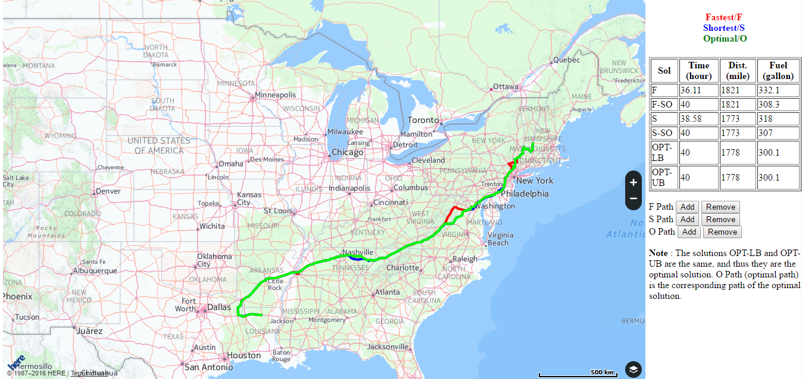

# PASO
Source codes for my research project for energy-efficient timely transportation.

## Publication 
**Lei Deng**, Mohammad H. Hajiesmaili, Minghua Chen, and Haibo Zeng, 
“Energy-Efficient Timely Transportation of Long-Haul Heavy-Duty Trucks,” 
in Prof. ACM International Conference on Future Energy Systems (e-Energy), June 2016.

## Paper and Slides
- Paper link: http://personal.ie.cuhk.edu.hk/~dl013/paper/EETT.eEnergy.16.pdf
- Slides link: http://personal.ie.cuhk.edu.hk/~dl013/paper/EETT.eEnergy.16.slides.pdf

## Problem Description

 
## Code Description
- I use C++ to implement all core parts (see [c++/src](c++/src)).
- I use MATLAB to model power-speed function (see [matlab/power.speed.function.modeling](matlab/power.speed.function.modeling)),
and process data and show figures (see [matlab/data.processing.and.show.fig](matlab/data.processing.and.show.fig)).

## Dataset
- **Transportation Network:** We construct the [U.S. National Highway Systems (NHS)](http://courses.teresco.org/chm/graphs/usa-national.gra)
from the [CHM Project](http://cmap.m-plex.com), 
with **84504** nodes (waypoints) and **89119** (one-direction) edges.
- **Elevation:** We use the [Elevation Point Query Service](http://nationalmap.gov/epqs/)
provided by the U.S. Geological Survey (USGS) to query elevations of all nodes in the NHS graph.
- **Speed Limit:** We use [HERE Map API](https://developer.here.com/api-explorer/rest/traffic/flow-using-corridor)
to obtain the speed limits of all road segments.
- **Heavy-Duty Truck and Fuel Consumption Data:** We use the widely  used [ADVISOR](http://adv-vehicle-sim.sourceforge.net/advisor_doc.html)
vehicle simulator to collection 
fuel-consumption data for a 36-ton truck [Kenworth T800](http://www.kenworth.com/trucks/t800).

## [A Sample Output](show_path_9_22_40.html)
